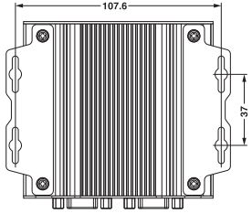
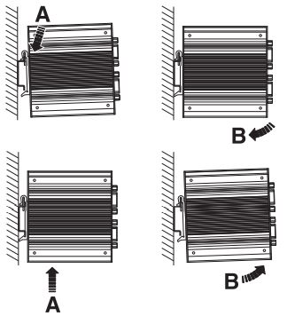
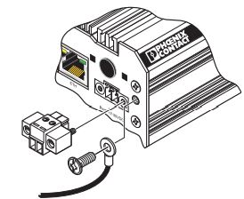
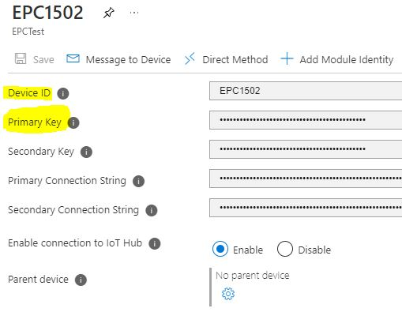
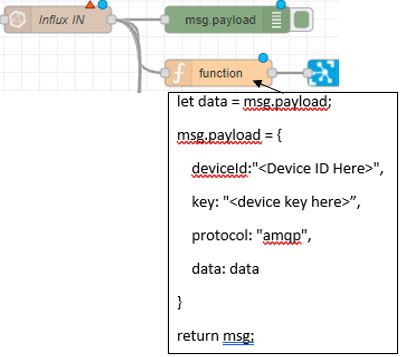
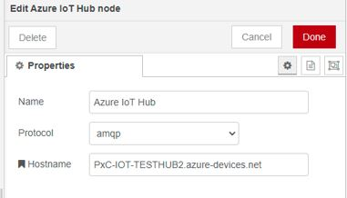
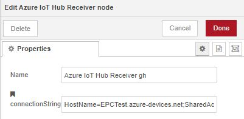
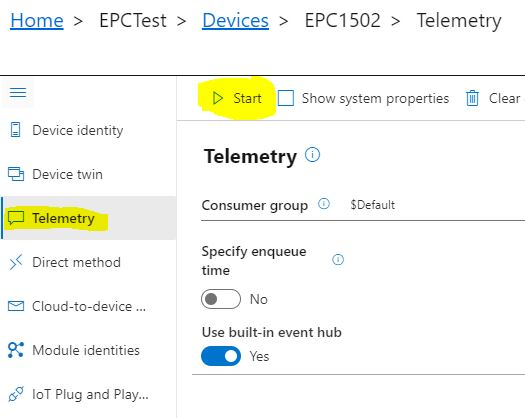
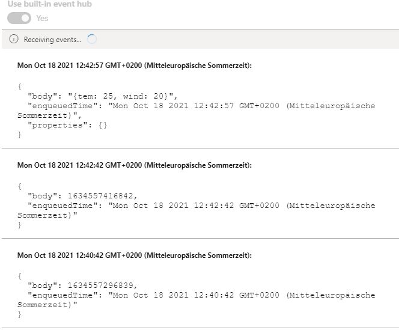

# Connect your EPC1502 / EPC 1522 device to your Azure IoT services

> [Example SourceCode](SourceCode/Quickstart_Flows/QuickGuideFlows/InfluxDB_to_AWS.json)

# Table of Contents

-   [Introduction](#Introduction)
-   [Prerequisites](#Prerequisites)
-   [Prepare your Device](#Prepareyourdevice)
-   [Connect to Azure IoT](#ConnecttoAzureIoT) 
-   [Integration with Azure IoT Explorer](#Explorer)
-   [Additional Links](#AdditionalLinks)

# Introduction
**About this document**
This document describes how to connect the Edge-PC EPC 1502 and EPC 1522 running PLCnext Linux Yocto with Azure IoT SDK. This multi-step process includes:

-   Configuring Azure IoT Hub
-   Registering your IoT device
-   Provisioning your devices on Device Provisioning service 
-   Build and deploy Azure IoT SDK on device

Prerequisites

You should have the following items ready before beginning the process:

-   [Prepare your development environment](https://github.com/Azure/azure-iot-sdk-c/blob/master/doc/devbox_setup.md)
-   [Setup your IoT hub](https://github.com/robertalorro/azure-iot-device-ecosystem/blob/master/setup_iothub.md)
-   [Provision your device over DPS](https://docs.microsoft.com/en-us/azure/iot-dps/about-iot-dps)

# Prepare your Device
## Set up your hardware
Choose the desired mounting method and follow the appropriate 
procedure.

### Wall mount
Order No. [1147655](https://www.phoenixcontact.com/product/1147655)  
The EPC 15x2 can be attached to a flat surface in a wall-mount orientation using the four key holes. The mounting surface must be flat and 
not subject to vibration.
>NOTE:
The EPC 15x2 must be installed with the connectors oriented 
down to allow the convection cooling to function efficiently  

 Installation:
 1.  Attach the two brackets to the EPC... using the included M3x5 
screws.Torque the screws to 0.5 Nm.
2.  Use the EPC 15x2 as a template and mark the locations of the 
mounting holes on the mounting surface.
3. Use the correct anchor type for the mounting surface and securely attach the EPC 15x2 to the wall. Ensure the attaching hardware is in the small section of the mounting holes.  

### DIN rail mount
Order No. [1147464](https://www.phoenixcontact.com/product/1147464)  
1. Install the mounting bracket on the EPC... with the included 
M3x5 screws so the connectors will be oriented downward after 
installation. Torque the screws to 0.5 Nm.
2. Angle the EPC 15x2 so the top edge of the mounting plate hangs on 
the top edge of the DIN rail.
3. Rotate the EPC 15x2 down against the lower edge of the DIN rail. 
Press in until the latch snaps closed.
4. Secure the device on the rail with clamps.
5. If necessary to remove, release the latch using a screwdriver, rotate the bottom of the EPC away, and then lift it straight up off 
the DIN rail.  

### Connecting the power supply
A removable plug (Order No. [1847055](https://www.phoenixcontact.com/product/1847055) on the EPC 15x2 accepts 
wire sizes of 0.2 ... 2.5 mm² (12 ... 24 AWG).
> NOTE:
To ensure safe operation, use safety extra-low voltage 
(SELV) according to DIN EN 61131 as supply voltage.
This device is protection class I item of equipment.

1. Connect the power conductors to the appropriate terminal in the 
connector.
2. Connect the ground/earth to the screw (5).
3. Insert the connector into the IPC.  

### Ethernet
Both ethernetports have their own MAC address.
> Default IP-address: X2 - 192.168.2.10 /// X3 - 192.168.1.10

The IP-adress can be set eather with [PLCnext Engineer](https://www.phoenixcontact.com/product/1046008) (PLC 61131 Engineering-Tool) or via Edge-Cockpit (deafult X2 - 192.168.2.10/cockpit).

> NOTE: Both ethernet-ports can be used to send data into Azure. 
Only X2 can be used for PROFINET.

# Connect to Azure IoT

Data will be send via Node-RED into MS Azure Cloud.
All needed software and tools come pre-installed with your Edge-PC!

1. All required nodes can be found in the pre-installed nodes of your EPC.  
  
2. Please import the [Example SourceCode](SourceCode/Quickstart_Flows/QuickGuideFlows/InfluxDB_to_AWS.json) to Node-RED.   
If you are unsure how to import a Flow into Node-RED, please see the explaination here: [How-To Node-RED](07_Node-RED_HowTo.md).
  
3. Create a new IoT device in Azure IoT Hub.  
  
Enter the device ID, Key, Protocol in Json script from the IoT device into the first function-node for connecting with Azure IOT Cloud Interface.  
    
4. Configure Azure IoT Hub Node:  
•	Enter Protocol and Hostname in Azure IoT Hub Node.  
  
5. Deploy the changes and send a message into Azure IoT Hub.
If your configuration was correct, the status of the IoT Hub node should be "Connected" or "Sent message".  
  
You can also receive messages from the cloud to the device using the "Azure IoT Hub Receiver" node.  
The connection string can be found in Azure IoT Hub under  
"Settings" > "Shared access policies" > "iothubowner" > "Primary connection string".  
  

>Another Connection-Example can be seen here: [Node-RED Azure Guide](https://flows.nodered.org/node/node-red-contrib-azure-iot-hub#:~:text=node-red-contrib-azure-iot-hub%20is%20a%20Node-RED%20node%20that%20allows%20you,Hub%20Receiver%20and%20Azure%20IoT%20Hub%20Device%20Twin)

# Integration with Azure IoT Explorer

Azure IoT Explorer is used to verify the data received from the database.   
1. Go to [Azure IoT explorer releases](https://github.com/Azure/azure-iot-explorer/releases) and expand the list of assets for the most recent release. Download and install the most recent version of the application.  
2. For a device, you can either connect your own device, or use one of the sample simulated devices. For some example simulated devices written in different languages, see the [Connect a sample IoT Plug and Play device application to IoT Hub](https://docs.microsoft.com/en-us/azure/iot-develop/tutorial-connect-device) tutorial.  
Select the device, you want to see data on and click on telemetry.  
Click on "Start" to receive the events.  

3. Start IoT Hub and create a new connection "Add connection".  
The connection sting can be found in Azure IoT Hub under  
"Settings" > "Shared access policies" > "iothubowner" > "Primary connection string".  
  

4. Open up your new connection by clicking on the device ID.  
Open up the "Telemetry" to see if data is beeing send into Microsoft Azure successfully.  
Start the "Telemetry" by clicking on the "Start" button.  
  

5. Trigger your Node-RED flows to send data into Microsoft Azure.  
This data should now be visible in the started "Telemetry" connection.  
  

# Additional Links

Please refer to the below link for additional information for Plug and Play.

-   [Manage cloud device messaging with Azure-IoT-Explorer](https://github.com/Azure/azure-iot-explorer/releases)
-   [Azure SDK](https://github.com/Azure/azure-iot-sdk-c/blob/master/provisioning_client/samples/prov_dev_client_sample/prov_dev_client_sample.c)
-   [Configure to connect to IoT Hub](https://docs.microsoft.com/en-us/azure/iot-pnp/quickstart-connect-device-c)
-   [How to use IoT Explorer to interact with the device](https://docs.microsoft.com/en-us/azure/iot-pnp/howto-use-iot-explorer#install-azure-iot-explorer)

 

Also, feel free to ask your question in our [PLCnext Forum](https://www.plcnext-community.net/en/discussions-2-offcanvas/forums.html).