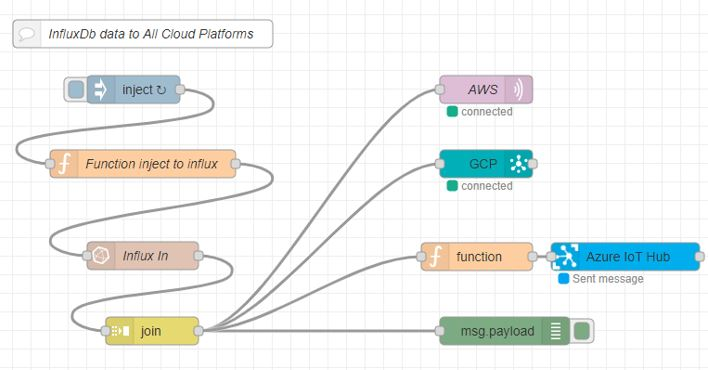
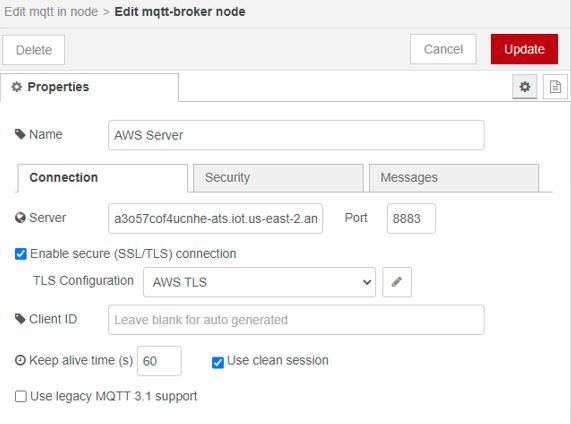
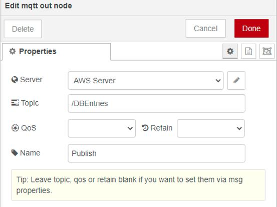
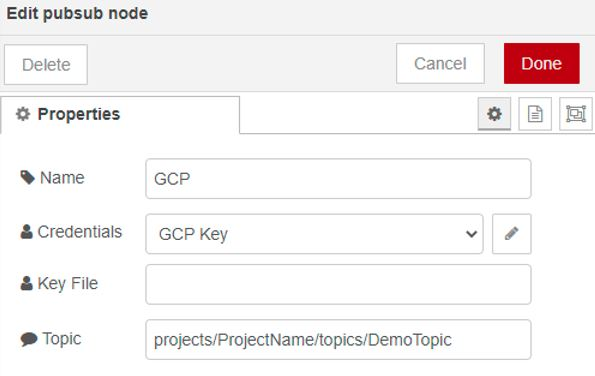
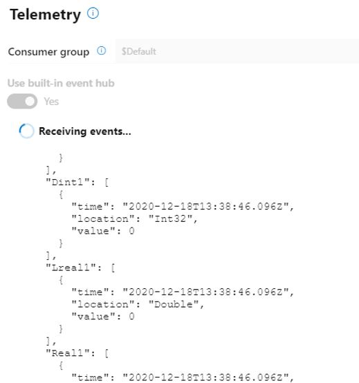
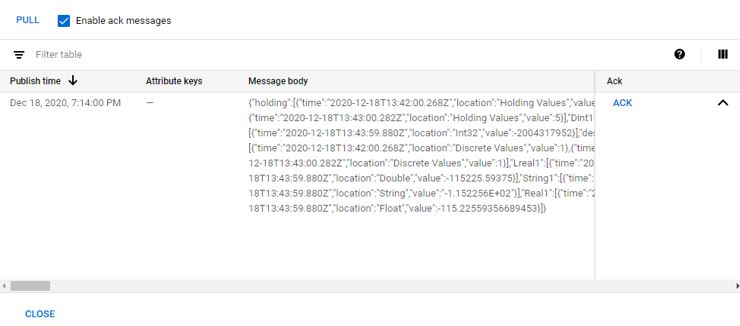

## Quick Reference Guide 
### For
## Phoenix Contact: EPC 1522 and EPC 1502
 
### Version: 1.2
---
# InfluxDB to Any-Cloud

This flow injects in every 2 min interval, a function node is provided to trigger multiple InfluxDB measurements at once using node.send (). All the queries are feed to InfluxDB. In node, this gives output for all queries. Results of all the queries are separate, they need to be joined using a Join node that joins them into an array.
The telemetry data collected can then be sent to different Cloud Platforms.

  
SourceCode: [InfluxDB to AnyCloud ](SourceCode/Quickstart_Flows/QuickGuideFlows/InfluxDB_To_Cloud.json)

### Configuration and Steps

>node.send({"query":"SELECT * from holding WHERE time > now() - 2m", "topic":"holding"});  
node.send({"query":"SELECT * from descrete WHERE time > now() - 2m","topic":"descrete"});  
node.send({"query":"SELECT * from Dint1 WHERE time > now() - 2m","topic":"Dint1"});  
node.send({"query":"SELECT * from Lreal1 WHERE time > now() - 2m","topic":"Lreal1"});  
node.send({"query":"SELECT * from Real1 WHERE time > now() - 2m","topic":"Real1"});  
node.send({"query":"SELECT * from String1 WHERE time > now() - 2m","topic":"String1"});  

# Configure mqtt out node for AWS configurations

Open Mqtt Out node and click on pencil icon against Server and Enter Server from AWS console and Port as 8883 and check the Enable secure (SSH/TLS) connection checkbox. Now click on pencil icon against TLS Configuration and attach all the certificates downloaded from AWS Console while creating the Thing. Click on Update button.  
  

Enter the topic name to publish the data to and it has to be same as mentioned in Cloud console Subscription.

  

### Configure the Function node for Azure connections

__Configure Pub Sub node__  
Configure Pub Sub node with GCP credentials, Key File, Topic name with respect to GCP cloud configuration. Click on Pencil icon against Credentials and enter the JSON key downloaded from GCP console.

  

### Data on AWS Console
Subscribe to a Topic in AWS console and use the same topic in AWS node in Node-RED application. After the data is triggered, it can be seen on AWS console window like below: 
> {  
    &ensp; "holding"  
    &ensp;{  
        &emsp; "time": "2021-04-12T13:37:01.670Z",  
         &emsp; "location": "Holding Values",  
         &emsp; "value": 5  
    &ensp;}  
    &ensp;{  
        &emsp; "time": "2021-04-12T13:37:01.670Z",  
        &emsp; "location": "Holding Values",  
        &emsp; "value": 5  
    &ensp;}  
    &ensp;{  
        &emsp; "time": "2021-04-12T13:37:01.670Z",  
        &emsp; "location": "Holding Values",  
        &emsp; "value": 5  
    &ensp;}  
    &ensp;"descrete"  
    &ensp;{  
        &emsp; "time": "2021-04-12T13:37:01.670Z",  
        &emsp; "location": "Holding Values",  
        &emsp; "value": 1  
    &ensp;}  
   { 

# Data on Azure IoT Explorer
Azure IoT Explorer is used to verify the data received from database. Select the device user wants to see data on and click on telemetry. Click on Start button to receive the events. 

  

# Data on Google Cloud Console
Create the topic and use the same topic in Pub/Sub node in Node-RED application to receive the data on Google Console. Select the topic and click on view messages and once user pulls the database’s data can be seen on cloud

  

### Other SourceCode-Flows to send data into Any Cloud:
 [InfluxDB to AWS](SourceCode/Quickstart_Flows/AWS/Influx_to_AWS.json)   [InfluxDB to Azure](SourceCode/Quickstart_Flows/Azure/Azure_with_Cloud_nodes.json)   
 [InfluxDB to Azure via MQTT](SourceCode/Quickstart_Flows/Azure/Azure_with_MQTT_nodes.json)