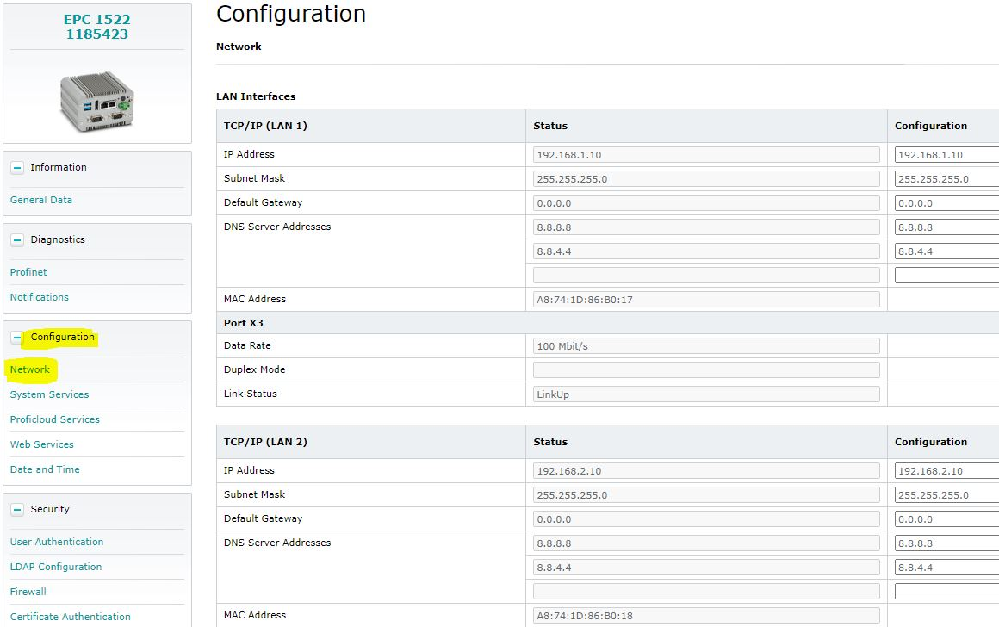
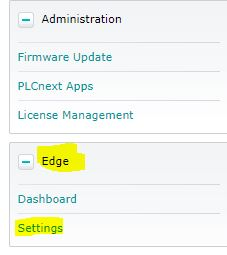
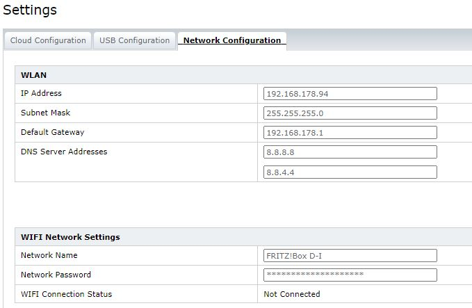
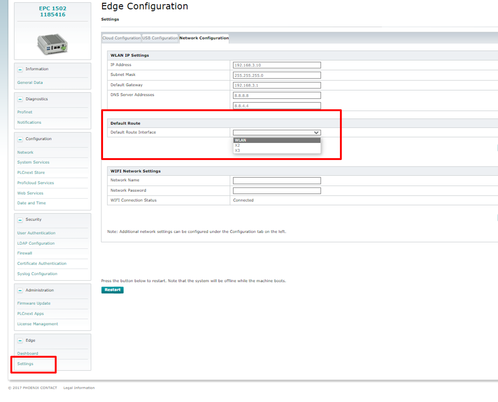

# Quick Reference Guide 

## Network and WIFI Configuration
 
To configure your device, connect your Host-PC with X3 (LAN1) of the EPC and connect to the Web Based Management (WBM) via ip-address/wbm  
> default: 192.168.1.10/wbm  

## Network Configuration

Your EPC comes with three network interfaces:  
> X3 (LAN1) - Profinet Controller  - Default 192.168.1.10  
> X2 (LAN2) - Generic Ethernet-Port - Default 192.168.2.10  
WIFI        - Generic WIFI wireless connection to your router - Default 192.168.3.10 

## Configure X3 LAN1 and X2 LAN2

To configure each port, switch to the "Configuration" tab in WBM and choose "Network"  
  

## Configure WIFI/WLAN - wireless connection to your router
Make sure the antenna is installed on your EPC.
To configure the WIFI, switch to the "Edge" tab in WBM and choose "Settings"  
  
Switch to "Network Configuration".  
Since the EPC does not support DHCP yet, we have to set the IP-address of the WIFI ourself.   Therefore you need to know your IP network address area.  

In the example shown below (network address area 192.168.178.x), I set the IP address to 192.168.178.94 and set the default gateway.  
You also have to to set the name and also the password of your WIFI.  
  
If your configuration is correct, the status should change to "connected" after a reboot.

## Important for internet access via X1, X2 or WIFI
Regardless of whether the connection was configured physically via ETH X1, ETH X2 or via WIFI to the router to access the internet, the "Default Route" has to be set in "Edge" --> "Settings".  
Set the "Default Route" to the port that is to connect to the Internet via the default gateway.  
  

 
 

Please see next chapter: [Using the DisplayPort](4_DisplayPort.md).   

