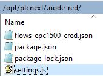

 Quick Reference Guide 
 

## Password potect the pre-installed Node-RED
 

By default, the Node-RED editor is not secured - anyone who can access its IP address can access the editor and deploy changes.  

This is only suitable if you are running on a trusted network.  

1. Open a new SSH-session (for example using PuTTy).  
Navigate to the folder /opt/plcnext/edge/nodejs/bin and create a new node-red hash-password using this commands:  

        cd /opt/plcnext/edge/nodejs/bin
        ./node-red admin hash-pw
    
    As soon as an input mask appears, type a password of your choice into it.  
    In my case, I choose "admin" to be the password (not recommended of course):  
    
      

    A new generated "node-red hash-pw" will be generated.  
    Copy the has-pw (long string starting with a $)  
    
    
2. Open up a new WinSCP Connection.  
Open the file "settings.js" inside the EPC /opt/plcnext/.node-red/  
  
Inside the file, navigate to the chapter "Securing Node-RED" which is currently commented out.  
  
Delete the comment-marks "//" as shown below, as well as the current hash-password.  
Paste the new hash-pw from the SSH-shell before (PuTTy).  
  

3. Save the file (settings.js) and close the WinSCP session.  
Restart your EPC, for example via the "Restart" button inside the WBM.  
After the restart, open up a web-browser and connect to Node-RED (default X3: 192.168.1.10:1880)  
A pop-up will appear asking for a log-in. Node-RED is now secured against unauthorized remote access.  
  

4. OPTIONAL  
We only secured Node-RED (default: Port 1880) against unauthorized access.  
If you want to install and use the Node-RED Dashboard UI, that you can install via the Node-RED Palette-Manager (default: Port 1880/ui) as well, you have to secure this access as well.  
To do so, the input "httpNodeAuth" inside the file "settings.js" has to be commented out as well.  
Enter the username (deafult: "admin"), as well as the node-red hash-pw you created in step 1 and safe the file.  
  