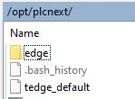

# Quick Reference Guide 

## Install and use the thin-edge.io App

  

## Introduction
thin-edge.io is the first open-source and cloud-agnostic edge framework designed for resource-constrained IoT edge devices.  
thin.edge.io offers out-of-the-box connectivity to many IoT platforms including  Cumulocity IoT, Azure IoT and more.  

[Works with Cumulocity IoT!](https://devicepartnerportal.softwareag.com/devices/phoenix-contact-deutschland-gmbh-edge-device-epc-1502/10282)  
This set-up will explain how to send data from the EPC 15x2 to the Cumulocity IoT platform.  
Cumulocity IoT gives you very fast visibility and control over your remote assets, be these houses, cars, machines or any other assets that you want to manage.  

1. Install the [thin-edge.io App](https://www.plcnextstore.com/permalinks/apps/latest/60002172000584) from our PLCnext Store.  
2. Install the PLCnext App via the WBM of your EPC.   
  
Before starting the App inside the WBM, create a new file inside /opt/plcnext/ named "tedge_default". You can do so by using "WinSCP" or via "Putty".  
  

3. Open the new file "tedge_default" and configure the entries to your Cumulocity tennant.  
>TEDGE__C8Y__URL='mytennant.eu-latest.cumulocity.com'  
TEDGE__DEVICE__ID='TestDevice65'  
TEDGE__CERT__UPLOAD__C8Y__USER='my.username@domain.tld'  
TEDGE__CERT__UPLOAD__C8Y__PASSWORD='SuperSecretPassword'  

4. Connect via SSH ("Putty") to the PLCnext control as admin user and use the following command to set the access rights of the file.

        chmod 600 /opt/plcnext/tedge_default 

 

5. After the configuration file is uploaded to the device and the access rights are set, the PLCnext App can be started by clicking the start button in the WBM.  
 
The App will install the thin-edge.io agent into the system. It creates
a test certificate with the provided device ID and will upload the certificate to the Cumulocity
tenant, if a valid username and password is provided. The provided user has to have set the
proper role in Cumulocity to upload device certificates to the tenant. The installer will also
connect the device to the Cumulocity cloud automatically. After the start of the PLCnext App has
finished the device should be present in the Cumulocity tenant.  
  

6. Test your connection  

        tedge mqtt pub tedge/measurements '{ "temperature": 25 }'

   Your measurement should be visible inside Cumulocity     